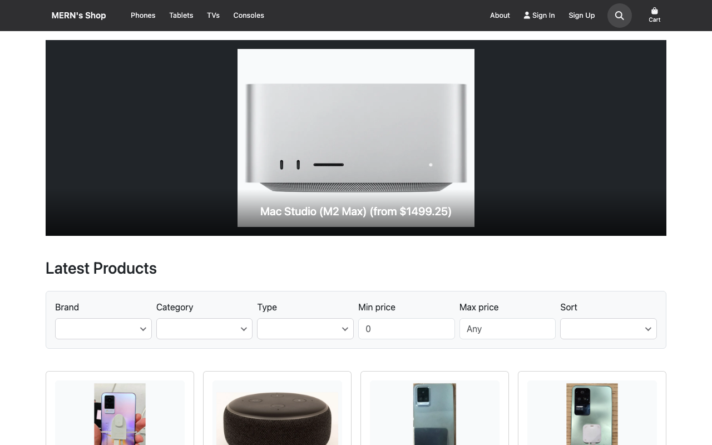
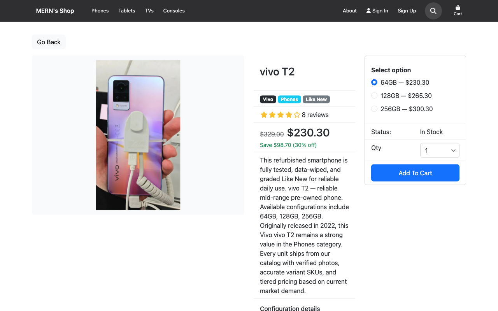
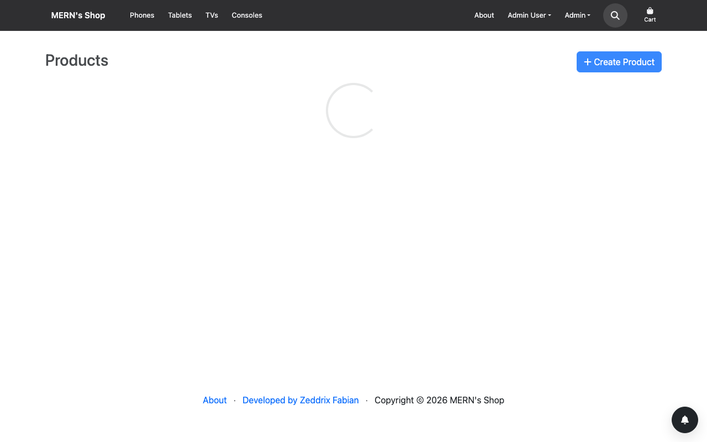

# MERN's Shop

> A portfolio-grade electronics e-commerce demo — full-stack MERN, PWA-ready, and built with acceptance test-driven development.

[](https://github.com/zeddrix/merns-shop/actions/workflows/ci.yml)
[](https://merns-shop.onrender.com/)
[](https://merns-shop.onrender.com/)

**Core:** [](README.md#tech-stack) [](https://nodejs.org/) [](https://www.typescriptlang.org/) [](https://pnpm.io/)

**Frontend:** [](https://react.dev/) [](https://vitejs.dev/) [](https://redux-toolkit.js.org/) [](https://reactrouter.com/) [](https://getbootstrap.com/) [](https://www.framer.com/motion/) [](https://react-hook-form.com/) [](https://zod.dev/) [](https://axios-http.com/)

**Backend:** [](https://expressjs.com/) [](https://mongoosejs.com/) [](https://www.mongodb.com/atlas) [](README.md#checkout-and-auth) [](README.md#tech-stack) [](README.md#pwa-and-notifications)

**PWA & UX:** [](README.md#pwa-and-notifications) [](README.md#pwa-and-notifications) [](README.md#pwa-and-notifications) [](README.md#responsive-ui-and-motion)

**Payments & SEO:** [](README.md#checkout-and-auth) [](docs/seo.md) [](docs/seo.md)

**Testing:** [](docs/e2e-testing-rules.md) [](docs/unit-testing-rules.md) [](docs/integration-testing-rules.md) [](docs/e2e-testing-rules.md)

**DevOps:** [](docker-compose.yml) [](.github/workflows/ci.yml) [](frontend/public/images/catalog/ATTRIBUTION.md)

**Catalog pipeline:** [](scripts/fetch-catalog-images.mjs) [](package.json) [](scripts/harvest-official-catalog-sources.mjs) [](scripts/audit-catalog-image-relevance.mjs) [](scripts/search-curate-catalog-images.mjs)

**[Live demo](https://merns-shop.onrender.com/)** · **[Source](https://github.com/zeddrix/merns-shop)** · Built by **[Zeddrix Fabian](https://www.linkedin.com/in/zeddrix-fabian-30a18029a/)**

---

## Screenshots

| Homepage | Product page | Admin products |
| -------- | ------------ | -------------- |
|  |  |  |

Regenerate locally: `pnpm readme:screenshots` (requires `pnpm dev` and MongoDB). See [`docs/images/readme/ATTRIBUTION.md`](docs/images/readme/ATTRIBUTION.md).

---

## What this is

MERN's Shop is a production-style online store for phones, tablets, TVs, and consoles — not a minimal CRUD tutorial. It demonstrates how a real e-commerce app handles catalog browsing, checkout, payments, admin operations, progressive web app behavior, and SEO for crawlers.

[Zeddrix Fabian](https://www.linkedin.com/in/zeddrix-fabian-30a18029a/) built it as a portfolio centerpiece: a live, deployable app that shows end-to-end full-stack skills from database design through responsive UI, automated testing, and cloud deployment.

The project started in 2021 as a Udemy MERN course exercise and was fully modernized in 2026 with TypeScript, React 19, Vite, Express 5, PWA support, web push notifications, and a comprehensive Playwright + Vitest test suite.

## Highlights

### Storefront

- **~170 parent products** with **500+ variants** (Apple, Samsung, Vivo, Xiaomi, Sony)
- Brand, category, price, and savings filters; variant picker on product pages
- Product reviews, search, pagination, and responsive layouts from phone to desktop

### Checkout and auth

- Guest and registered customer flows through cart, shipping, payment, and order confirmation
- **PayPal sandbox** checkout integration
- Session auth via **httpOnly cookies** (no JWT in `localStorage`)
- Customer registration, profile management, and order history

### Admin

- Full admin panel: **products**, **orders**, and **users** CRUD
- Order fulfillment workflow and user privilege management

### PWA and notifications

- Installable progressive web app with offline shell and service-worker update recovery
- **Web push notifications** for order status updates and in-app notification bell

### SEO

- Canonical URLs, Open Graph tags, dynamic `sitemap.xml`, JSON-LD structured data, and crawler-friendly HTML

### Quality

- **Acceptance test-driven development (ATDD)** with Playwright E2E journey specs
- Vitest unit and integration test suites; CI quality gates (Prettier, TypeScript, ESLint)

## Tech stack

| Layer            | Technology                  | Version           |
| ---------------- | --------------------------- | ----------------- |
| Runtime          | Node.js                     | 22+ (`.nvmrc`)    |
| Package manager  | pnpm                        | 9+                |
| Language         | TypeScript                  | ^5.8.2            |
| Backend          | Express                     | ^5.1.0            |
| ODM              | Mongoose                    | ^9.0.0            |
| Database (local) | MongoDB                     | 7 (Docker)        |
| Database (prod)  | MongoDB Atlas               | M0                |
| Frontend         | React                       | ^19.0.0           |
| Bundler          | Vite                        | ^6.2.3            |
| State            | Redux Toolkit               | ^2.6.1            |
| UI               | Bootstrap / react-bootstrap | ^5.3.3 / ^2.10.9  |
| Forms            | react-hook-form + Zod       | ^7.77.0 / ^3.24.2 |
| Payments         | PayPal JS SDK (sandbox)     | ^8.8.2            |
| PWA              | vite-plugin-pwa + Workbox   | ^1.3.0 / ^7.4.1   |
| Push             | web-push                    | ^3.6.7            |
| Motion           | Framer Motion               | ^12.9.2           |
| Testing          | Vitest + Playwright         | ^3.0.9 / ^1.57.0  |
| Hosting          | Render                      | free web service  |

## Deployed on

Production runs on **[MongoDB Atlas M0](https://www.mongodb.com/atlas)** (database) and **[Render](https://render.com/)** (free-tier web service).

- **Live app:** [https://merns-shop.onrender.com/](https://merns-shop.onrender.com/)
- **Deployment guide:** [`docs/deployment-atlas-render.md`](docs/deployment-atlas-render.md)

The free Render tier may cold-start after ~15 minutes of idle time; the first request can take 30–60 seconds.

## About the developer

**[Zeddrix Fabian](https://www.linkedin.com/in/zeddrix-fabian-30a18029a/)** is a software developer who builds full-stack web applications with the MERN stack. MERN's Shop is his featured portfolio project — from original 2021 learning exercise to a 2026 modernization with modern TypeScript tooling and rigorous automated testing.

- [LinkedIn](https://www.linkedin.com/in/zeddrix-fabian-30a18029a/)
- [Portfolio on GitHub](https://github.com/zeddrix/portfolio)
- [MERN's Shop source](https://github.com/zeddrix/merns-shop)
- [About page on the live app](https://merns-shop.onrender.com/about)

---

## Developer guide

### Requirements

- **Node.js 22+** (use `nvm use` — see [`.nvmrc`](.nvmrc))
- **pnpm 9+**
- **Docker** (local MongoDB only)
- **Git LFS** (catalog product photos — required for clone/commit)

### Quick start (local development)

#### 1. Prerequisites

This repo needs **Node 22 only here** — your other projects can keep Node 20 as the global default.

```bash
cd /path/to/merns-shop
nvm install      # one-time: installs Node 22 from .nvmrc
nvm use          # this terminal only (does not change nvm default)
node -v          # should print v22.x
docker compose up -d mongo
```

Do **not** run `nvm alias default 22` unless you want every new terminal on Node 22. With `nvm use`, only shells where you ran it in this folder use 22.

**Optional (auto-switch when you `cd` here):** add to `~/.zshrc`:

```bash
autoload -U add-zsh-hook
load-nvmrc() {
  local nvmrc_path="$(nvm_find_nvmrc 2>/dev/null)"
  if [ -n "$nvmrc_path" ]; then
    nvm use --silent
  fi
}
add-zsh-hook chpwd load-nvmrc
load-nvmrc
```

Then opening this project directory runs `nvm use` automatically; other folders still use your default (e.g. Node 20).

**Git LFS (catalog images):**

```bash
brew install git-lfs    # macOS; or apt install git-lfs on Linux
git lfs install
git lfs pull            # after clone or pull when catalog images change
```

Catalog photos under `frontend/public/images/catalog/` are stored with Git LFS. Commits that touch those files fail if `git-lfs` is not installed.

Confirm Mongo is listening:

```bash
docker compose ps
# or: mongosh "mongodb://127.0.0.1:27017/merns-shop" --eval "db.runCommand({ ping: 1 })"
```

#### 2. Install and configure

```bash
nvm use          # required before install if your default is Node 20
pnpm install     # fails fast if Node < 22; validates catalog WebP assets (or fetches if manifest URLs set)
cp .env.example .env
cp .env.test.example .env.test
# Set VITE_SITE_URL and SITE_URL for SEO (see docs/seo.md)
pnpm catalog:validate   # all catalog WebP paths exist and meet size thresholds
pnpm db:seed
```

#### 3. Run the app

**Recommended — API + Vite together:**

```bash
pnpm dev    # auto-selects Node 22 here via nvm; leaves your global Node 20 unchanged
```

| Service  | URL                   |
| -------- | --------------------- |
| Frontend | http://localhost:5020 |
| API      | http://localhost:5021 |

**Alternative — separate terminals:**

```bash
pnpm server    # API on :5021 (tsx watch)
pnpm client    # Vite on :5020
```

Seeded users: see [`docs/test-users.md`](docs/test-users.md).

Auth uses an **httpOnly cookie** (no JWT in `localStorage`).

#### Customer sign-up

New shoppers can create an account at **http://localhost:5020/register** (also linked from **Sign Up** in the header and from the login screen).

| Field            | Requirement                         |
| ---------------- | ----------------------------------- |
| Name             | Required                            |
| Email            | Valid email; must not already exist |
| Password         | At least 6 characters               |
| Confirm password | Must match password (client-side)   |

After a successful sign-up, the API sets the same session cookie as login and the app redirects to `/` or to the `redirect` query target (for example `/shipping` when checking out as a guest). New accounts redirected to `/` see a brief **Welcome, {name}** message on the home page (`register-welcome`).

E2E coverage: `tests/e2e/auth/login-register-profile.e2e.test.ts`, `tests/e2e/checkout/cart-shipping-payment.e2e.test.ts`, and `tests/e2e/journeys/journey-customer-auth-profile-lifecycle.e2e.test.ts`.

#### Gadget catalog (offline-first)

- **~170 parent products** with **500+ variants** (Apple, Samsung, Vivo, Xiaomi, Sony) live in [`backend/data/catalog/`](backend/data/catalog/).
- Each product has nested **variants** (storage, screen size, etc.) with **MSRP `listPrice`** and tiered **second-hand `price`** (see [`backend/data/catalog/pricing.ts`](backend/data/catalog/pricing.ts)).
- Images are **WebP** files under [`frontend/public/images/catalog/`](frontend/public/images/catalog/) (Git LFS). Sources and licenses are listed in [`catalog-image-manifest.json`](catalog-image-manifest.json). See [`frontend/public/images/catalog/ATTRIBUTION.md`](frontend/public/images/catalog/ATTRIBUTION.md).
- Refresh images: `pnpm catalog:sources` (Wikimedia Commons URLs) then `pnpm catalog:images` (download + convert).
- Validate catalog data: `pnpm catalog:validate`
- Storefront: brand/category filters, savings badges, variant picker on product pages.

### SEO

Canonical URLs, Open Graph, `robots.txt`, dynamic `sitemap.xml`, JSON-LD, and crawler HTML are configured via `VITE_SITE_URL` and `SITE_URL`. See [`docs/seo.md`](docs/seo.md).

### Responsive UI and motion

The storefront uses **Bootstrap 5** breakpoints plus shared CSS tokens in [`frontend/src/index.css`](frontend/src/index.css) for spacing, touch targets, and carousel scaling on phone/tablet/desktop.

- **Cart and checkout** line items use a card layout below `md` and a table-like row at `md+` ([`CartLineItem`](frontend/src/components/CartLineItem.tsx), [`OrderLineItem`](frontend/src/components/OrderLineItem.tsx)).
- **Motion:** CSS hover/focus on product cards and primary buttons; **Framer Motion** for route transitions and home product-grid stagger. Animations respect `prefers-reduced-motion: reduce` (instant transitions when enabled in OS settings).
- **Icons:** Font Awesome is bundled via `@fortawesome/fontawesome-free` (no CDN dependency).
- **E2E:** mobile viewport journeys in [`tests/e2e/misc/responsive-layout.e2e.test.ts`](tests/e2e/misc/responsive-layout.e2e.test.ts).

### Quality and tests

Regenerate README screenshots (requires `pnpm dev` and MongoDB):

```bash
pnpm readme:screenshots
```

```bash
pnpm quality          # format + tsc + eslint
pnpm quality:fast     # tsc + eslint (CI parity)
pnpm test:unit
pnpm test:integration
pnpm test:e2e         # Spawns dedicated E2E stack (ports 5030 + 5031); needs Mongo
pnpm test:e2e:dev     # Reuse a running `pnpm dev:e2e` on :5030/:5031 (no extra server spawn)
pnpm dev:e2e          # Start E2E stack manually for iterative test runs
```

**E2E preflight:** Mongo must be running before E2E. Playwright seeds the DB in global setup. Tests hit **http://localhost:5030** (UI + proxied `/api/*`). Manual browsing stays on **http://localhost:5020** — both can run at the same time (they share MongoDB, so E2E seed/mutations can still affect manual dev data).

Run a single E2E file:

```bash
pnpm test:e2e:one -- tests/e2e/smoke/app-boot.e2e.test.ts
```

#### PayPal sandbox E2E

Add to `.env.test`:

- `PAYPAL_CLIENT_ID`
- `PAYPAL_SANDBOX_BUYER_EMAIL`
- `PAYPAL_SANDBOX_BUYER_PASSWORD`

PayPal specs run automatically when `.env.test` has real (non-placeholder) sandbox credentials. Otherwise they are skipped with an explicit message. PayPal-tagged tests run in a serial **`paypal` Playwright project** after the main suite (see `docs/e2e-testing-rules.md`).

```bash
pnpm test:e2e:paypal          # canonical PayPal spec only (isolated)
PW_RUN_PAYPAL=1 pnpm test:e2e # full suite + journey PayPal opt-in test
```

`pnpm verify:full` runs the full E2E suite once (including the PayPal project when creds are set).

**CI PayPal job:** set repository variable `ENABLE_PAYPAL_E2E=true` and secrets `PAYPAL_CLIENT_ID`, `PAYPAL_SANDBOX_BUYER_EMAIL`, `PAYPAL_SANDBOX_BUYER_PASSWORD`.

#### Verification gates

| Command            | What it runs                                                     |
| ------------------ | ---------------------------------------------------------------- |
| `pnpm verify`      | format, quality, unit, integration, build                        |
| `pnpm verify:full` | above + full E2E (PayPal project once when creds in `.env.test`) |

### Deployment

Production uses **MongoDB Atlas M0** and **Render**. Complete local verification first, then follow [`docs/deployment-atlas-render.md`](docs/deployment-atlas-render.md) (ISSUE-015 repo rename + Atlas + Render are manual steps).

### Database

Local and test environments use:

```text
mongodb://127.0.0.1:27017/merns-shop
```

Minimum MongoDB version: **6.0** (Docker image uses Mongo **7**).
